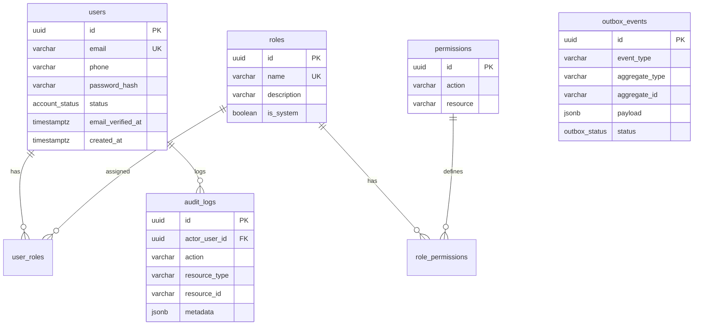

# INOVENT — Database Architecture & Conventions

**Database Engine:** PostgreSQL 16  
**ORM:** Prisma ORM 6.x  
**Schema File:** `prisma/schema.prisma`

---

## 1. Design Conventions

### 1.1 Identifiers & Primary Keys
- All primary keys use **UUID v4** represented in PostgreSQL as native `@db.Uuid`.
- Avoids auto-incrementing integer enumeration attacks and facilitates client-side ID generation or offline sync.

### 1.2 Table & Column Naming
- **Database Layer:** `snake_case` table names (`@@map("users")`, `@@map("audit_logs")`) and column names (`@map("password_hash")`, `@map("created_at")`).
- **TypeScript Layer:** Standard `camelCase` properties for idiomatic NestJS/TypeScript development.

### 1.3 Timestamps & Timezones
- All timestamps use PostgreSQL `TIMESTAMPTZ(6)` (timestamp with time zone).
- All server-side mutations write **UTC timestamps**.
- Standard audit timestamps:
  - `createdAt`: Set automatically on row creation (`@default(now())`).
  - `updatedAt`: Managed automatically via `@updatedAt`.

### 1.4 Soft Deletion
- Business-critical entities (such as `User`, `Event`, `Community`) include a `deletedAt DateTime?` field.
- Soft-deleted records are preserved for audit and historical integrity, with queries filtering where `deletedAt: null`.

---

## 2. RBAC & Identity Foundation (Sprint 1)

The Sprint 1 baseline establishes a flexible, normalized role and permission structure:



### Account Status Lifecycle
Identity account status is kept strictly separate from domain state machines:
- `PENDING`: Newly registered account awaiting email OTP or admin approval (Sponsors, Vendors, Providers, Media).
- `ACTIVE`: Fully verified and approved account.
- `REJECTED`: Application rejected by Admin (rejection reason stored in profile audit).
- `SUSPENDED`: Temporarily suspended for moderation review.
- `DEACTIVATED`: Voluntary closure by user or complete termination.

---

## 3. Database Indexes & Query Optimization

- **Unique Constraints:** Composite unique constraints enforce integrity at the database layer (e.g. `[action, resource]` on `Permission`, `[userId, roleId]` on `UserRole`).
- **B-Tree Indexes:** Applied to foreign keys (`userId`, `roleId`), search fields (`email`), status columns (`status`), and temporal orderings (`createdAt`).
- **Composite Indexes:** Established for high-frequency access patterns (e.g. `[status, createdAt]` on `outbox_events`).

---

## 4. Transaction Boundaries & Concurrency Guarantees

All multi-step mutations must be enclosed in explicit Prisma transactions:
```typescript
await prisma.$transaction(async (tx) => {
  // 1. Mutate business entity
  // 2. Decrement capacity / check limits
  // 3. Write outbox event
  // 4. Write audit log
});
```
This guarantees atomicity: if any step fails, the entire operation rolls back.

---

## 5. Migration Strategy

- **Development:** `npx prisma migrate dev --name <migration_name>`
- **CI & Production:** `npx prisma migrate deploy`
- `prisma db push` is strictly prohibited in production environments.
