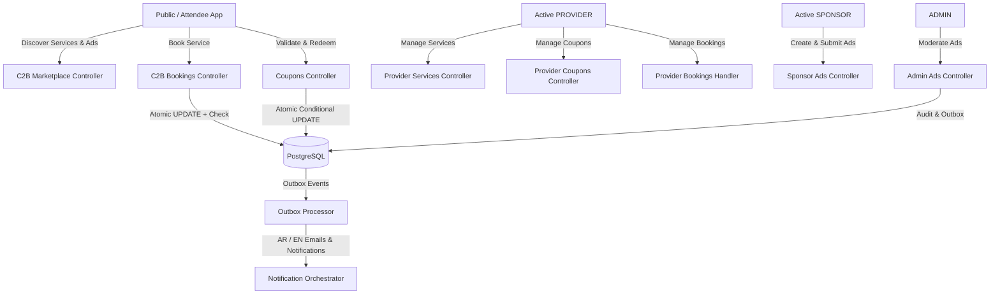

# INOVENT — Sprint 8 Implementation Plan
## C2B Marketplace, Sponsor Ads & Coupons Platform

### 1. Executive Summary & Objectives
Sprint 8 extends the INOVENT Smart Event Ecosystem with three major business domains:
1. **C2B Marketplace & Services**: Event-scoped marketplace for accredited `PROVIDER` accounts (Hotels/Accommodation, Transportation, Restaurants, Discount Coupons, Visas/Travel Services).
2. **Attendee Booking/Contact Requests**: Lightweight communication & request workflow (`PENDING`, `CONFIRMED`, `REJECTED`, `CANCELLED`, `COMPLETED`) with transaction-safe capacity enforcement (`maxBookings`).
3. **Provider Coupon System**: Event/service-linked coupons with normalized codes, anti-replay, one-per-attendee enforcement (`@@unique([couponId, attendeeId])`), validation, and atomic transaction-safe redemption.
4. **Sponsor Ads & Admin Moderation**: Ad submission by active `SPONSOR` accounts, explicit lifecycle (`DRAFT` -> `PENDING_REVIEW` -> `APPROVED` -> `PUBLISHED`), admin moderation, and public query-level expiration filtering.

---

### 2. Architecture & Domain Design



---

### 3. Database Schema & Prisma Migration (`20260912160000_sprint_8_c2b_ads_coupons`)
- **Enums**:
  - `C2bServiceCategory`: `ACCOMMODATION`, `TRANSPORTATION`, `RESTAURANTS`, `COUPONS`, `TRAVEL_SERVICES`, `OTHER`
  - `C2bBookingStatus`: `PENDING`, `CONFIRMED`, `REJECTED`, `CANCELLED`, `COMPLETED`
  - `DiscountType`: `PERCENTAGE`, `FIXED_AMOUNT`
  - `SponsorAdStatus`: `DRAFT`, `PENDING_REVIEW`, `APPROVED`, `PUBLISHED`, `REJECTED`, `PAUSED`, `EXPIRED`
  - `SponsorAdPlacement`: `MARKETPLACE`, `EVENT_PAGE`, `BANNER_TOP`, `SIDEBAR`
  - `NotificationType` extensions: `C2B_BOOKING_REQUESTED`, `C2B_BOOKING_STATUS_CHANGED`, `SPONSOR_AD_SUBMITTED`, `SPONSOR_AD_APPROVED`, `SPONSOR_AD_REJECTED`, `COUPON_REDEEMED`
- **Models**:
  - `C2bService` (with index on provider, event, category, expiresAt, deletedAt)
  - `C2bBooking` (with index on attendee, provider, status)
  - `Coupon` (with unique `normalizedCode`, eventId, serviceId, maxRedemptions)
  - `CouponRedemption` (with `@@unique([couponId, attendeeId])` and unique `idempotencyKey`)
  - `SponsorAd` (with sponsorId, eventId, status, startsAt, endsAt, reviewedBy)

---

### 4. Concurrency & Atomicity Invariants
1. **Booking Capacity Invariant (`maxBookings`)**:
   Atomic SQL update:
   ```sql
   UPDATE c2b_services
   SET booking_count = booking_count + 1
   WHERE id = :serviceId
     AND (max_bookings IS NULL OR booking_count < max_bookings)
     AND is_available = true
     AND expires_at > NOW()
     AND deleted_at IS NULL
   ```
2. **Coupon Redemption Invariant (`maxRedemptions` & Anti-Double-Redeem)**:
   - Database constraint `@@unique([couponId, attendeeId])` guarantees that parallel requests from the same attendee fail immediately with 409 Conflict.
   - Atomic conditional update on coupon table guarantees that parallel requests from different attendees never exceed `maxRedemptions`:
   ```sql
   UPDATE coupons
   SET redemption_count = redemption_count + 1
   WHERE id = :couponId
     AND is_active = true
     AND expires_at > NOW()
     AND (starts_at IS NULL OR starts_at <= NOW())
     AND (max_redemptions IS NULL OR redemption_count < max_redemptions)
     AND deleted_at IS NULL
   ```

---

### 5. Event Scoping & Dynamic Expiration Invariant
- A C2B service's `expiresAt` is clamped to the associated event's `endsAt` (`expiresAt = Math.min(expiresAt, event.endsAt)`).
- Public discovery query strictly enforces:
  `event.endsAt > NOW()`, `service.expiresAt > NOW()`, `event.status IN ('PUBLISHED', 'ONGOING')`, `event.visibility = 'PUBLIC'`, and `provider.status = 'ACTIVE'`.
- Expired services and ads vanish from queries instantaneously, even before the background sweep executes.

---

### 6. Notifications & Localized Emails
- Localized email templates in `EmailTemplateService`:
  - `C2B_BOOKING_REQUESTED` (AR RTL + EN LTR)
  - `C2B_BOOKING_STATUS_CHANGED` (AR RTL + EN LTR)
  - `SPONSOR_AD_SUBMITTED` (AR RTL + EN LTR)
  - `SPONSOR_AD_APPROVED` (AR RTL + EN LTR)
  - `SPONSOR_AD_REJECTED` (AR RTL + EN LTR)
  - `COUPON_REDEEMED` (AR RTL + EN LTR)
- Outbox processor routes these events with deterministic idempotency keys.

---

### 7. RBAC & IDOR Security Matrix
- `manage:c2b_service`: `PROVIDER` (asserts account status = `ACTIVE`)
- `create:c2b_booking`: `ATTENDEE`
- `manage:c2b_booking`: `PROVIDER`
- `manage:coupon`: `PROVIDER`
- `redeem:coupon`: `ATTENDEE`
- `manage:sponsor_ad`: `SPONSOR` (asserts account status = `ACTIVE`)
- `review:sponsor_ad`: `ADMIN`
- IDOR checks:
  - Provider A cannot update/delete Provider B's services or coupons.
  - Provider A cannot view or update Provider B's bookings.
  - Attendee A cannot view Attendee B's bookings.
  - Sponsor A cannot modify Sponsor B's ads.
  - Sponsor cannot approve ads. Provider cannot approve ads.
  - Pending/Suspended providers and sponsors cannot create or update services or ads.

---

### 8. Verification Strategy
1. **Unit Test Suites**:
   - `c2b-services.service.spec.ts`
   - `c2b-bookings.service.spec.ts`
   - `coupons.service.spec.ts`
   - `sponsor-ads.service.spec.ts`
   - `c2b-expiration.service.spec.ts`
2. **Comprehensive E2E Integration Suite** (`test/c2b-marketplace.e2e-spec.ts`):
   - Provider service lifecycle & status gating.
   - Event scoping & instantaneous post-event disappearance.
   - Concurrency: 10 parallel booking requests against `maxBookings = 2` -> exactly 2 succeed.
   - Concurrency: 10 parallel coupon redemptions against `maxRedemptions = 3` -> exactly 3 succeed.
   - Duplicate coupon redemption by same attendee -> exactly 1 succeeds, others rejected.
   - Sponsor ad lifecycle: draft -> submit -> admin approve/reject -> public visibility -> post-expiry disappearance.
   - IDOR & cross-role access rejection.
3. **Full Regression Suite**:
   - `npm run typecheck`
   - `npm run lint`
   - `npm run format:check`
   - `npm test`
   - `npm run test:e2e`
   - `npm run build`
   - `npx prisma validate`
